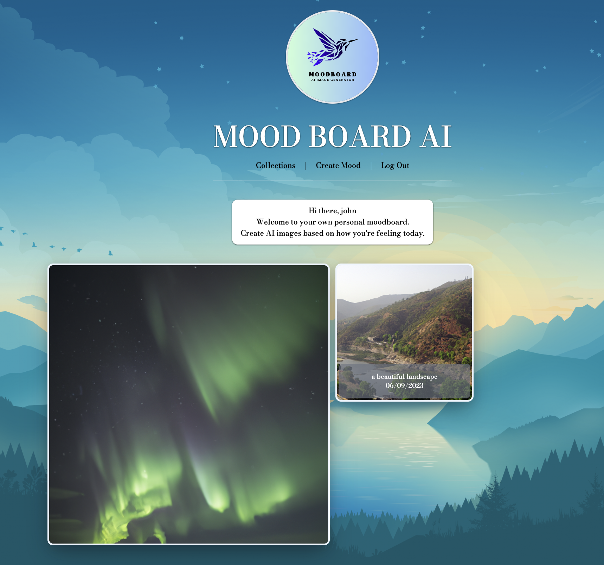

<h1> MOODBOARD AI </h1>
<h3>Create your own personal moodboard using DALL-E OpenAI API</h3>

Explore an imaginative field of images created by AI. Here, you create an image by entering a prompt and add that image to your collection. 

<!-- TABLE OF CONTENTS -->

  
Table of Contents

  <ol>
    <li>
      <a href="#getting-started">Getting Started</a>
    </li>
    <li>
      <a href="#technologies-used">Technologies Used</a></li>
    </li>
    <li>
      <a href="#game-board">MoodBoard</a>
    </li>
    <li>
      <a href="#next-steps">Next Steps</a>
    </li>
    <li>
      <a href="#acknowledgments">Acknowledgements</a>
    </li>
  </ol>

## Getting Started

Insert txt here
<a href="https://moodboard-mern.netlify.app/" width="250px">Click here to start creating!</a>

## Technologies Used

MongoDB, Mongoose, Express, React, Node.js
JavaScript, Tailwind, CSS, HTML, Vite, Cloudinary

## MoodBoard

   

## Next Steps

<ul>
 <li>Create a search bar feature to filter through images</li>
 <li>Create multiple moodboards based on different themes (tropical, winter, autumn)</li>
</ul>

## Acknowledgments

<ul>
  <li> <a href="https://platform.openai.com/docs/guides/images/introduction">OPEN AI API Documentation</a>
  <li> <a href="https://tailwindcss.com/">Tailwind</a>
  <li> <a href=" https://dev.to/stlnick/how-to-deploy-a-full-stack-mern-app-with-heroku-netlify-ncb">Deployment Heroku/Netlify</a>
</ul>
